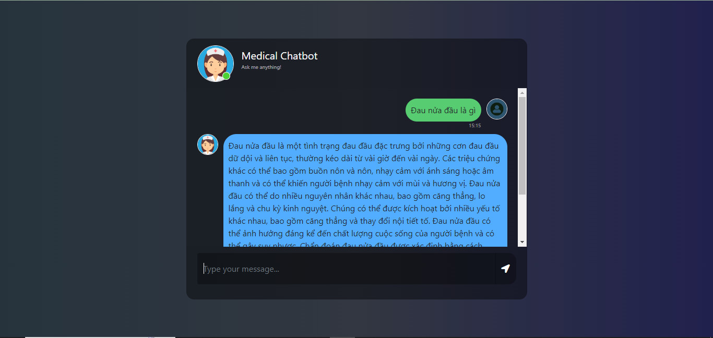

# vni medical-chatbot


# End-to-end-Medical-Chatbot-using-Llama2

# How to run?
### STEPS:

Clone the repository

```bash
Project repo: https://github.com/
```

### STEP 01- Create a virtual environment after opening the repository (i use vscode)

```bash
python -m venv venv
```

```bash
.\.venv\Scripts\activate
```

### STEP 02- install the requirements
```bash
pip install -r requirements.txt
```


### Create a `.env` file in the root directory and add your Pinecone credentials as follows:

```ini
PINECONE_API_KEY = "xxxxxxxxxxxxxxxxxxxxxxxxxxxxx"
PINECONE_API_ENV = "xxxxxxxxxxxxxxxxxxxxxxxxxxxxx"
```

### Run app

```bash
# run the following command
python store_index.py
```

```bash
# Finally run the following command
python app.py
```

Now,
```bash
open up localhost:
```


### Techstack Used:

- Python
- LangChain
- Flask
- Pinecone

